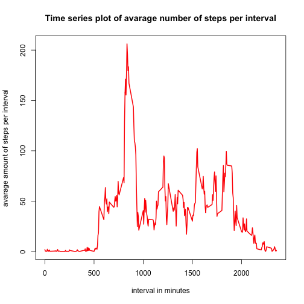
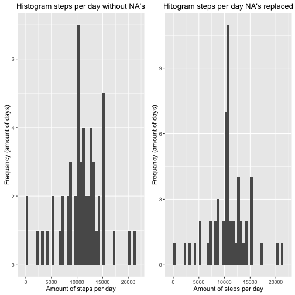
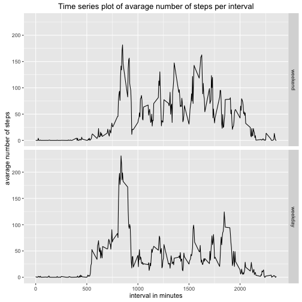

## Loading and preprocessing the data

### Show any code that is needed to

1. Load the data


```r
# set working directory
setwd("/Users/MichiFede/Desktop/Coursera/Reproducible Research/RepData_PeerAssessment1")
# read data and safe to my data variable
if(!file.exists('activity.csv')){
    unzip('activity.zip')
}
mydata<-read.csv("activity.csv", header=TRUE)
head(mydata)
```

```
##   steps       date interval
## 1    NA 2012-10-01        0
## 2    NA 2012-10-01        5
## 3    NA 2012-10-01       10
## 4    NA 2012-10-01       15
## 5    NA 2012-10-01       20
## 6    NA 2012-10-01       25
```

2. Process/transform the data (if necessary) into a format suitable for your analysis

I will transform the data further on, as soon as i know what data is needed and which format in preferrible. For now the data in compact and clean enough to go on.

## What is mean total number of steps taken per day?

### For this part of the assignment, you can ignore the missing values in the dataset.

1. Calculate the total number of steps taken per day

```r
# aggregate my data by date summing steps
steps_day <- aggregate(steps ~ date, data=mydata, sum, na.rm=TRUE)
head(steps_day)
```

```
##         date steps
## 1 2012-10-02   126
## 2 2012-10-03 11352
## 3 2012-10-04 12116
## 4 2012-10-05 13294
## 5 2012-10-06 15420
## 6 2012-10-07 11015
```

2. If you do not understand the difference between a histogram and a barplot, research the difference between them. Make a histogram of the total number of steps taken each day

```r
library(ggplot2)
# we draw a histogram showing the amount of cases for every different amouont of stept per date and save this plot to variable p1
p1 <- qplot(steps_day$steps, geom="histogram", binwidth=500) + 
      labs(title = "Hitogram Steps per Day") + 
      xlab("Amount of steps per day") + 
      ylab("Frequancy (amount of days)")

# we draw a horizontal barplot showing the amount of steps per day and save this plot to variable p2
p2 <- ggplot(data=steps_day, aes(x=date, y=steps)) + 
      geom_bar(stat="identity")+coord_flip() + 
      labs(title = "Barplot Steps per Day") + 
      xlab("Date") + 
      ylab("Amount of steps")

# in order to show two plots in one panel we use the *gridExtra* package
library(gridExtra)
grid.arrange(p1,p2, ncol=2)
```

 

3. Calculate and report the mean and median of the total number of steps taken per day

```r
mean_without_NA <- mean(steps_day$steps)
median_without_NA <- median(steps_day$steps)
```

```r
mean_without_NA
```

```
## [1] 10766.19
```

```r
median_without_NA
```

```
## [1] 10765
```

We see that the median for the total numbers of steps taken per day is 10765 and the mean value is 10766.19

## What is the average daily activity pattern?

1. Make a time series plot of the 5-minute interval and the average number of steps taken, averaged across all days.

```r
# we aggregate the avarage amount of steps per interval
steps_interval <- aggregate(mydata$steps, 
                       by=list(mydata$interval), 
                       FUN=mean, 
                       na.rm=TRUE)
# and assign the two column names
names(steps_interval)<-c("Interval", "StepsMean")
```

Here you see how the new dataset looks like:

```r
head(steps_interval)
```

```
##   Interval StepsMean
## 1        0 1.7169811
## 2        5 0.3396226
## 3       10 0.1320755
## 4       15 0.1509434
## 5       20 0.0754717
## 6       25 2.0943396
```

```r
# we plot a line-chart showing the mean of the steps over the various time intervals
plot(steps_interval$Interval, steps_interval$StepsMean,  
     type="l", col="red", lwd=2, 
     main="Time series plot of avarage number of steps per interval", 
     xlab="interval in minutes", 
     ylab="avarage amount of steps per interval")
```

 

2. Which 5-minute interval, on average across all the days in the dataset, contains the maximum number of steps?

```r
# we look for the index of the row containing the maximum value for the avarage amount of steps
max_index <- which.max(steps_interval$StepsMean)

# and subset the dataset to that index
max_interval <- steps_interval$Interval[max_index]
max_interval
```

```
## [1] 835
```

We see that the maximum mean value per time interface is of 835 stept in 5 minutes.

## Imputing missing values

### Note that there are a number of days/intervals where there are missing values. The presence of missing days may introduce bias into some calculations or summaries of the data.

1. Calculate and report the total number of missing values in the dataset.

```r
# we count the amount of non complete cases with this formula:
sum(!complete.cases(mydata))
```

```
## [1] 2304
```

There are 2304 rows with missing values out od the 17568 rows.

2. Devise a strategy for filling in all of the missing values in the dataset. The strategy does not need to be sophisticated. For example, you could use the mean/median for that day, or the mean for that 5-minute interval, etc.

We wille compute the mean for all time interval, without counting the NA values and impute those values to the NA values beeing in that same category.

3. Create a new dataset that is equal to the original dataset but with the missing data filled in.

```r
# we create a second data set equal to mydata
mydata2 <- mydata

# we search for the indices of the rows with NA values and save them as incomplete_index
incomplete_index <- which(!complete.cases(mydata2))

# for every incomplete_index we impute the NA value with the mean of the values of that same time interval
for (i in seq_along(incomplete_index)) {
    subset_interval <- subset(mydata2, mydata$interval == mydata2$interval[i])
    agg_subset <- aggregate(subset_interval$steps, by=list(subset_interval$interval), FUN=mean, na.rm=TRUE)
    mydata2[i,1] <- agg_subset[1,2]
}
# this is how the new data looks like
head(mydata2)
```

```
##       steps       date interval
## 1 1.7169811 2012-10-01        0
## 2 0.3396226 2012-10-01        5
## 3 0.1320755 2012-10-01       10
## 4 0.1509434 2012-10-01       15
## 5 0.0754717 2012-10-01       20
## 6 2.0943396 2012-10-01       25
```

In the new dataset we see that the missing values we had before are now substitudes by valid values.

4. Make a histogram of the total number of steps taken each day and Calculate and report the mean and median total number of steps taken per day. Do these values differ from the estimates from the first part of the assignment? What is the impact of imputing missing data on the estimates of the total daily number of steps?

```r
library(ggplot2)
# we create a hitogram identical to the one we created before but with the new dataset, containing imputed values instead of NA's
steps_day2 <- aggregate(steps ~ date, data=mydata2, sum)
hist_end <- qplot(steps_day2$steps, geom="histogram", binwidth=500) + 
      labs(title = "Hitogram steps per day NA's replaced") + 
      xlab("Amount of steps per day") + 
      ylab("Frequancy (amount of days)")

# we create a panel with two histograms, the same as before and the new one 
p1 <- p1+labs(title="Histogram steps per day without NA's")
grid.arrange(p1,hist_end, ncol=2)
```

 

We see that the two histograms differ, altough it's not yet clear in what the difference exaclty consist.


```r
# we calculate the new values for the mean and the median
mean_NA_replaced <- mean(steps_day2$steps)
median_NA_replaced <- median(steps_day2$steps)

# and create two vectors containing the new and the old values for the mean and the median
mean <- cbind(mean_without_NA, mean_NA_replaced)
median <- cbind(median_without_NA, median_NA_replaced)
```

```r
mean
```

```
##      mean_without_NA mean_NA_replaced
## [1,]        10766.19         10803.13
```

```r
median
```

```
##      median_without_NA median_NA_replaced
## [1,]             10765           10766.19
```

We see that the mean value had increased with more than 100 steps and the median has not really changed.

## Are there differences in activity patterns between weekdays and weekends?

### For this part the weekdays() function may be of some help here. Use the dataset with the filled-in missing valies for this part.

1. Create a new factor variable in the dataset with two levels ??? *weekday* and *weekend* indicating whether a given date is a weekday or weekend day.

```r
# we use the lubridata package to transform the factor date in date format
library(lubridate)

# we create a vector containig the names of the day's for the "week part"
weekday <- c("Monday", "Tuesday", "Wednesday", "Thursday", "Friday")

# we create a factor with two levels. If the weeday is present in the vector above, than we assign "weekday" to that factor, otherwise we assign it the "weekend" value.
mydata2$weekpart <- factor(weekdays(ymd(mydata2$date)) %in% weekday, labels=c("weekend", "weekday"))

# this is how the data looks like
head(mydata2)
```

```
##       steps       date interval weekpart
## 1 1.7169811 2012-10-01        0  weekday
## 2 0.3396226 2012-10-01        5  weekday
## 3 0.1320755 2012-10-01       10  weekday
## 4 0.1509434 2012-10-01       15  weekday
## 5 0.0754717 2012-10-01       20  weekday
## 6 2.0943396 2012-10-01       25  weekday
```

2. Make a panel plot containing a time series plot (i.e. ???????????????? = "????") of the 5-minute interval (x-axis) and the average number of steps taken, averaged across all weekday days or weekend days (y-axis)

```r
# we aggregate the data calculating the mean for every combination of interval + weekpart
steps_interval_end <- aggregate(mydata2$steps, 
                       by=list(mydata2$interval,mydata2$weekpart), 
                       FUN=mean, 
                       na.rm=TRUE)

# we assign names to every column of this new dataset
names(steps_interval_end)<-c("Interval", "WeekPart", "StepsMean")

# and draw a plot with two panels, one for de week part and one for the weekend, showing the mean of the steps per intervals over time
ggplot(steps_interval_end, aes(Interval, StepsMean)) + 
      geom_line() + facet_grid(WeekPart ~ . ) + 
      labs(title="Time series plot of avarage number of steps per interval") + 
      xlab("interval in minutes") + 
      ylab("avarage number of steps")
```

 

We can see that there is difference between week and weekend but from this plot it's not still clear in what this difference really consists.

